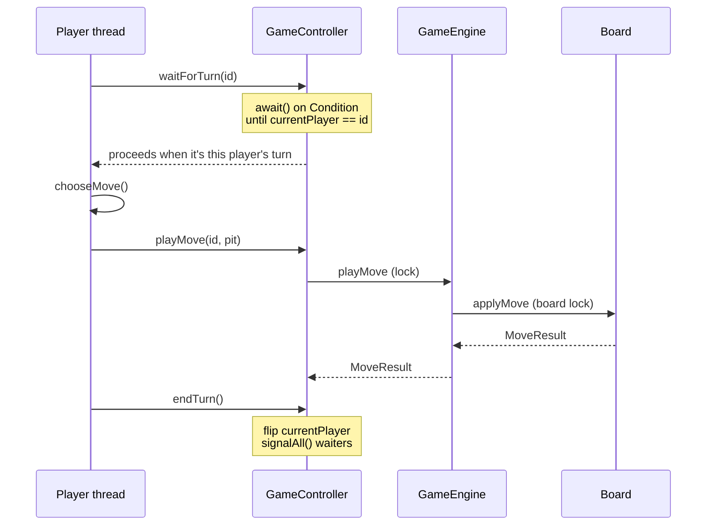

# Ayò — A Concurrent, Multi-Threaded Game Engine in Java

A playable implementati

on of **Ayò** (a two-row, mancala-family seed-sowing game) built as an exercise in **concurrent programming**. Each player runs on its own thread, turns are arbitrated with a lock and a condition variable, and all shared state is guarded so that two threads can never corrupt the board mid-move.

The game itself is the domain; the real subject is **safe coordination of concurrent threads over shared mutable state** — the same problem that shows up in any backend that handles simultaneous requests.

---

## Concurrency & design highlights

- **Thread-per-player model.** Every player is a `Runnable` executed on its own `Thread`. Human, AI-vs-human, and AI-vs-AI modes are all just different combinations of threads sharing one board.
- **Turn arbitration with a `Condition`.** `GameController` uses a `ReentrantLock` plus a `Condition` (`playerTurn`). A player thread calls `waitForTurn(id)` and blocks (`await()`) until it is its turn; `endTurn()` flips the active player and `signalAll()`s the waiters. The wait loop guards against spurious wakeups and game-over, so no thread proceeds out of turn.
- **Thread-safe shared board.** Every read and mutation on `Board` (`applyMove`, `isValidMove`, `isGameOver`, `getScores`, …) executes inside the board's lock, so move application is atomic with respect to other threads.
- **Serialized move application.** `GameEngine` wraps each move in a `ReentrantLock` as a defensive invariant, so move application stays atomic while the board lock protects each operation's internals. Because turn alternation (below) already guarantees a single mover, this lock is currently uncontended — it's insurance for if the turn discipline is ever relaxed.
- **Defensive copying for isolation.** `getScores()` returns a clone, and `getBoardSnapshot()` returns a full `Board.clone()` — so callers (and the AI) reason over private copies and can never mutate live game state by accident.
- **Parallel move evaluation.** `AIPlayer` fans out candidate moves across a fixed `ExecutorService` thread pool, simulating each on an isolated board snapshot via `Future`s and selecting the highest-scoring one. (The heuristic is a greedy one-move lookahead — it maximises immediate capture; see *Possible extensions* for deepening it.)
- **Thread-safe logging.** `GameLogger` synchronises output and tags every line with a timestamp and thread name, so the console log makes the interleaving of player threads visible and easy to trace.

---

## Architecture

```
src/
├── Main.java                  # Entry point: wires up the board, engine, controller, and player threads
├── model/
│   ├── Board.java             # Lock-guarded game state: pits, scores, move + capture logic
│   ├── GameEngine.java        # Serializes move application behind a lock
│   └── MoveResult.java        # Immutable result of a move (success, captured seeds, game-over)
├── controller/
│   └── GameController.java    # Turn arbitration via ReentrantLock + Condition
├── player/
│   ├── Player.java            # Abstract Runnable player (the run loop: wait → move → end turn)
│   ├── HumanPlayer.java       # Reads moves from the console
│   └── AIPlayer.java          # Parallel move evaluation over a thread pool
└── util/
    └── GameLogger.java        # Thread-safe, timestamped logging
```

The layering is deliberate: `model` knows nothing about threads beyond protecting its own state, `controller` owns turn coordination, and `player` owns the per-thread run loop. Concurrency concerns are concentrated where they belong rather than smeared across the codebase.

---

## How a turn flows



---

## Getting started

**Requirements:** JDK 17+. The build uses Maven via the bundled **Maven Wrapper** (`./mvnw`), so a separate Maven install is not required — the wrapper downloads Maven on first run.

**Build (compile + run tests):**

```bash
./mvnw clean test          # on Windows: mvnw.cmd clean test
```

**Run the game:**

```bash
./mvnw exec:java           # on Windows: mvnw.cmd exec:java
```

You'll be prompted to pick a mode:

```
Select Game Mode:
1. Human vs Human
2. Human vs AI
3. AI vs AI
```

Pits `0–5` belong to Player 1 and pits `6–11` to Player 2; enter the pit number you want to sow from when prompted.

---

## Rules (as implemented)

- The board has **12 pits**, each starting with **4 seeds**. Player 1 owns pits 0–5, Player 2 owns pits 6–11.
- On your turn you pick one of your non-empty pits; its seeds are sown one-by-one counter-clockwise around the board.
- If the **last** seed lands in a pit **on your own side** that then holds **2 or 4** seeds, those seeds are **captured** into your score.
- The round ends when either side has no seeds left to play; remaining seeds are swept to their owner, and the higher score wins.

---

## Possible extensions

Natural next steps, roughly in order of value:

- **Deeper AI search.** Replace the greedy one-move heuristic with **minimax + alpha–beta pruning**, parallelised across the existing thread pool — a natural fit given moves are already evaluated on isolated snapshots.
- **Unit tests.** Cover move validation, sowing wrap-around, and the capture rule (JUnit 5 is already wired into the Maven build), plus a concurrency test asserting turn order under `AI vs AI`.
- **A non-console interface.** Expose the engine behind a small REST or WebSocket layer so games can be driven over the network — a clean way to reuse the thread-safe core.

---

## Tech

Java · `java.util.concurrent` (`ReentrantLock`, `Condition`, `ExecutorService`, `Future`) · standard library only, no external dependencies.